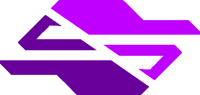
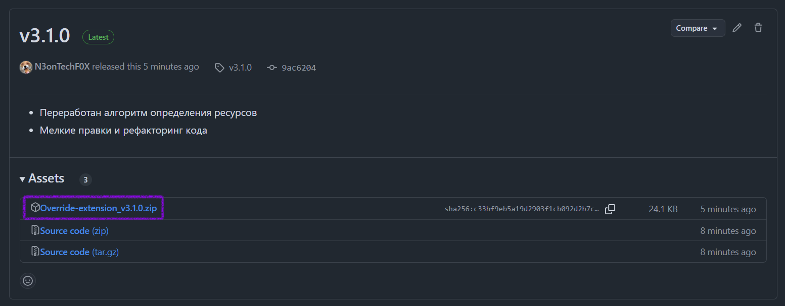
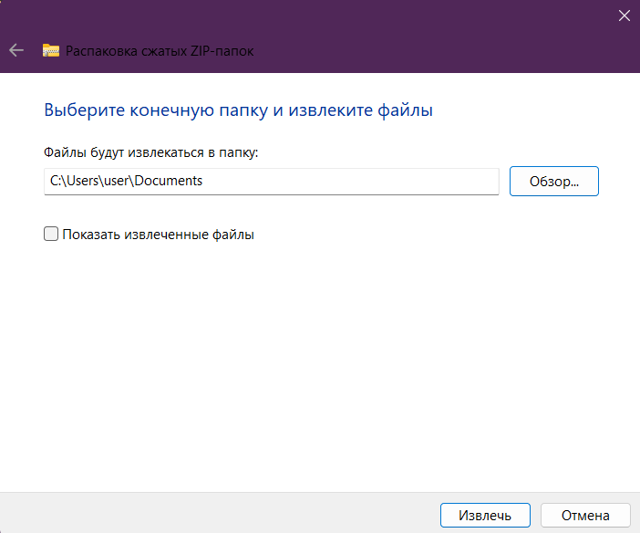
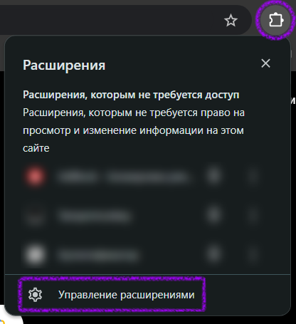
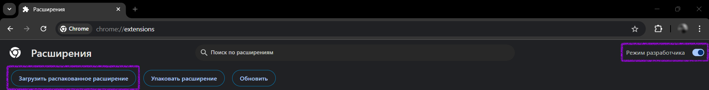
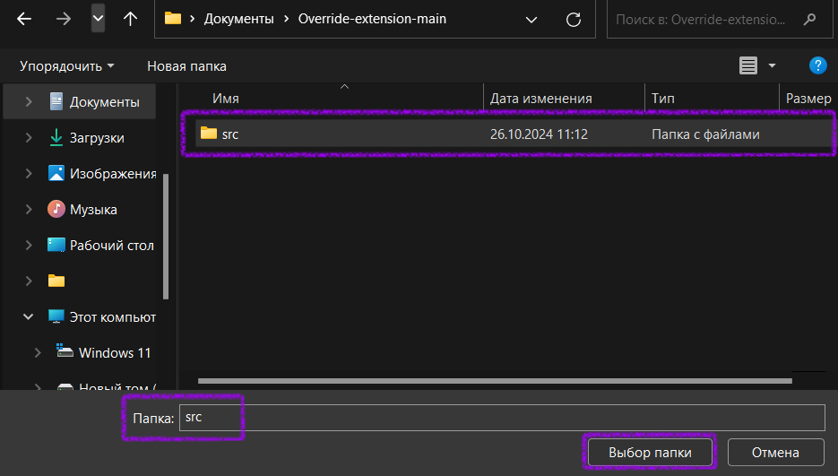
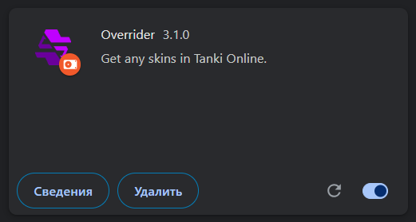
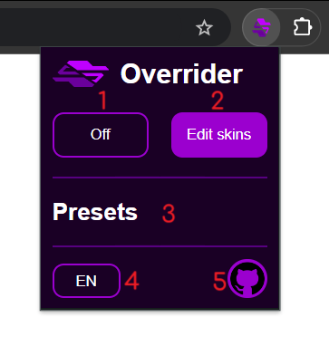
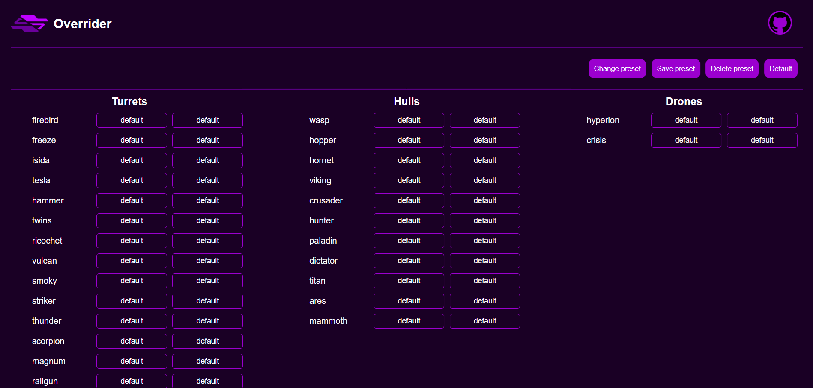

> # ⚠️ Важно!
> # По состоянию на 28.07.2026 появилась информация о возможных блокировках аккаунтов за использование подмены ресурсов в Tanki Online. На данный момент эта информация не подтверждена, однако до выяснения обстоятельств рекомендуется использовать расширение на свой страх и риск.  
---

# Override-extension

  

Override-extension - ээто визуальный мод для игры, позволяющий заменить стандартные скины танков на любые другие из [доступной базы](https://github.com/N3onTechF0X/TankiTextures), без необходимости владения ими в аккаунте. Удобный интерфейс, пресеты, и гибкие настройки - всё ради кастомизации.

## Оглавление

- [Установка](#установка)
- [Использование](#использование)
- [Известные проблемы](#известные-проблемы)
- [ЧаВо (Частые вопросы)](#чаво-частые-вопросы)
- [Обратная связь](#обратная-связь)
- [Благодарности](#благодарности)

## Установка  

1. Скачать последнюю версию расширения из releases 
  
2. Распаковать архив в любое удобное место  
  
3. Перейти на вкладку расширений браузера  
  
4. Включить режим разработчика и нажать на "Загрузить распакованное расширение"  
  
5. Найти ранее распакованную папку  
  
6. После выполнения этих пунктов в браузере должно появиться новое расширение  
  

## Использование  

После установки расширения вы можете открыть всплывающее окно, нажав на его иконку.  
  
> (1) Включение/выключение подмены  
> (2) Кнопка открытия сайта с выбором нужных скинов  
> (3) Сохранённые пресеты  
> (4) Выбор языка  
> (5) Гитхаб проекта  

Чтобы выбрать скины, нажмите на кнопку `(2)` Edit skins.  
  
Возле каждой пушки/корпуса/дрона есть выбор скина, который вы хотите получить.  
  
  
Например, если нужно заменить рикошет RF, найдите строку с пушкой «ricochet» (зависит от выбранного языка) и в выпадающем списке выберите RF. Перейдите на вкладку с танками и обновите страницу (не забудьте включить расширение `(1)`).  
  
Теперь, если вы оденете рикошет, вы увидите на нём скин RF.  

## Известные проблемы

1. **"Клоны" танков**: При подмене корпусов на старые ХТ или легаси скины могут появляться летающие "клоны" танков.

## ЧаВо (Частые вопросы)

1) Крашится игра при входе
- Если игра крашится при включении именно этого расширения в консоли должны быть сообщения об ошибке, в них указано, в чём может быть проблема.
2) Скин не сменился
- Обратите внимание! Расширение меняет только стандартный скин на другой, если у вас уже стоит какой-то скин на корпусе/пушки снимите его.
- Возможно такого скина нет на выбранный корпус/пушку или он еще не добавлен в базу, проверьте репозиторий [TankiTextures](https://github.com/N3onTechF0X/TankiTextures), скин должен быть помечен `+`.
3) Можно ли получить бан за использования этого расширения?
- Нет, расширение никоим образом не влияет на игру. Официально правила игры запрещают любые модификации, которые дают преимущество в игре, но Overrider не изменяет игровой процесс и не предоставляет таких преимуществ.
4) В базе нет нового скина, будут ли добавлены новые скины?
- Да, по мере появления новых скинов база обновляется, следите за репозиторием [TankiTextures](https://github.com/N3onTechF0X/TankiTextures).
- Если у вас уже есть на аккаунте скин которого нет в базе (скин помечен как `?`) вы можете помочь проекту написав разработчику в любую из соц сетей [Обратная связь](#обратная-связь).
5) Видят ли другие игроки заменённые скины?
- Нет, расширение лишь подменяет текстуры на вашем компьютере и другие игроки видят стандартный скин, который и был до замены.
6) Влияет ли расширение на производительность игры?
- Нет, скины загружаются точно так же как это делает сама игра.

## Обратная связь

  
  

## Благодарности

#### Попкорн

- 🍿 - за то что ты есть

#### Помощь с кодом

- [xeon](https://github.com/xeon-git) - идеи по улучшению кода
- Ryukotsu - идеи и отладка кода
