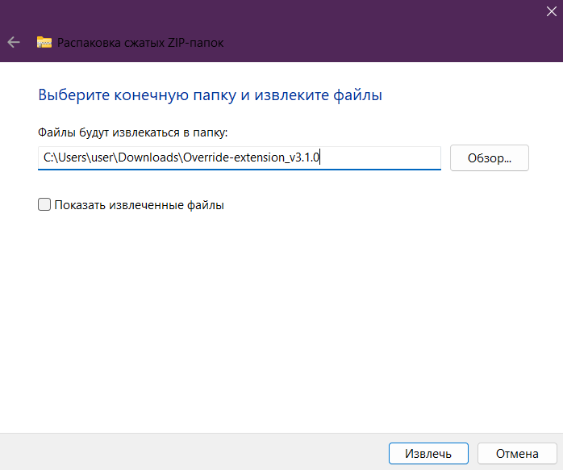
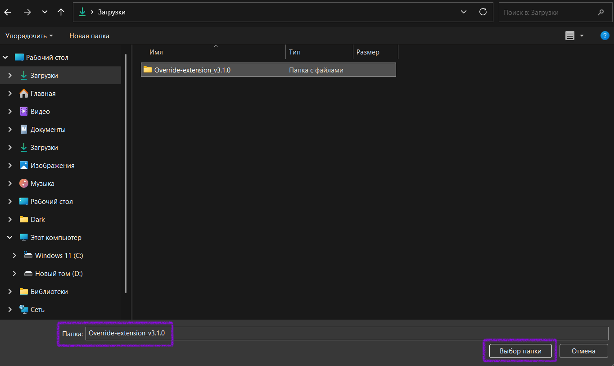
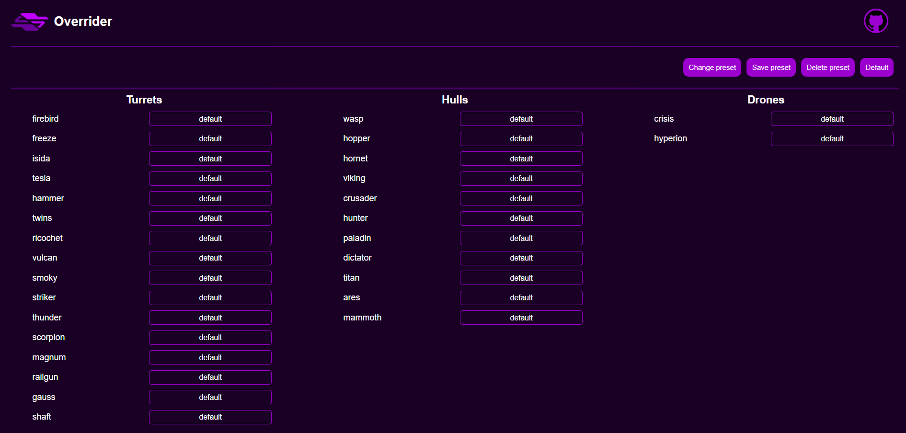

# Override-extension

⚠️ На данный момент расширение не работает, в связи с ~~ДОЛБОЕБИЗМОМ РАЗРАБОТЧИКОВ ТАНКОВ~~ сменой ссылок  

Override-extension - это расширение для браузера на основе скрипта [Overrider](https://github.com/N3onTechF0X/Overrider).
Основная функция проекта - подмена скинов в игре. Вы можете одеть на свой танк любой[^1] скин, даже если у вас его нет на аккаунте.  
Расширение отличается от скрипта удобным интерфейсом для выбора скинов, возможностью сохранять пресеты и множеством других функций.  
  
[^1]: Который есть в базе расширения. В репозитории [TankiTextures](https://github.com/N3onTechF0X/TankiTextures) вы можете посмотреть какие скины доступны,  а какие еще не найдены.  

## Установка  

1. Скачать zip файл расширения  
  
2. Распаковать архив в любое удобное место  
  
3. Перейти на вкладку расширений браузера  
  
4. Включить режим разработчика и нажать на "Загрузить распакованное расширение"  
  
5. Найти ранее распакованную папку и в ней выбрать папку src  
  
6. После выполнения этих пунктов в браузере должно было появится новое расширение  
  

## Использование  

После установки расширения вы можете открыть всплывающее окно, нажав на его иконку.  
  
> (1) Включение/выключение подмены  
> (2) Кнопка открытия сайта с выбором нужных скинов  
> (3) Сохранённые пресеты  
> (4) Выбор языка  
> (5) Гитхаб проекта  

Чтобы выбрать скины, нажмите на Edit skins (2).  
  
Возле каждой пушки/корпуса/дрона есть выбор скина, который вы хотите получить.  
  
  
Например, если нужно заменить рикошет RF, найдите строку с пушкой «ricochet» (зависит от выбранного языка) и в выпадающем списке выберите RF. Перейдите на вкладку с танками и обновите страницу (не забудьте включить расширение (1)).  
  
Теперь, если вы оденете рикошет, вы увидите на нём скин RF.  

## Другая информация

Дополнительная информация, включая разделы `Известные проблемы`, `ЧаВо` и `Обратная связь`, доступна в [ReadMe скрипта Overrider](https://github.com/N3onTechF0X/Overrider/blob/main/README.md).  
